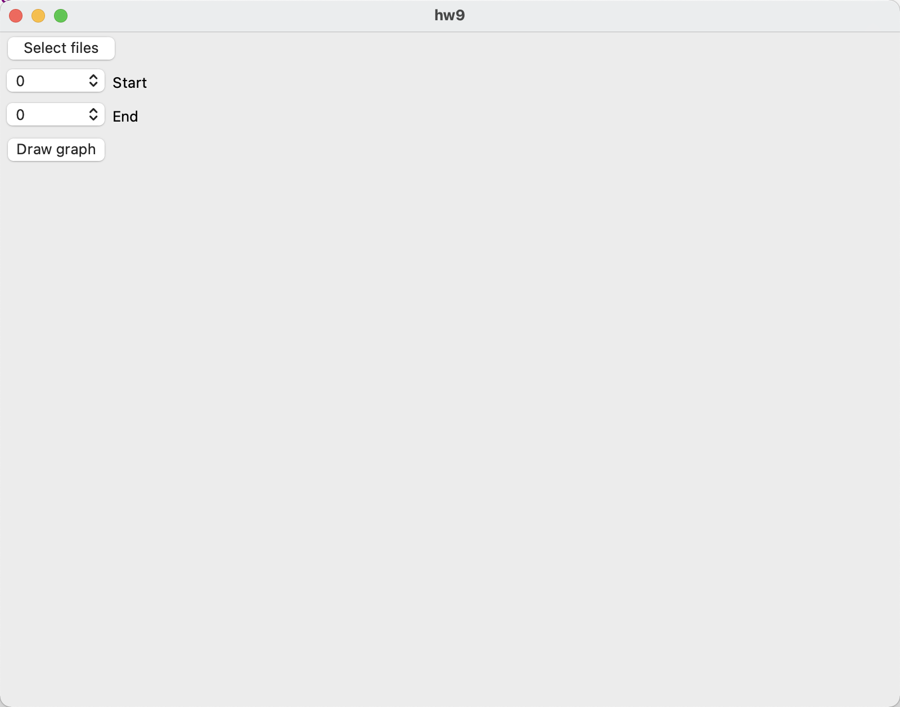
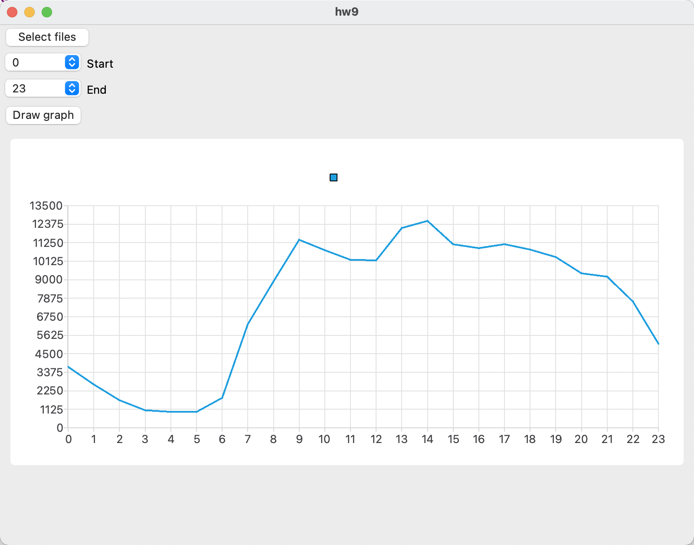
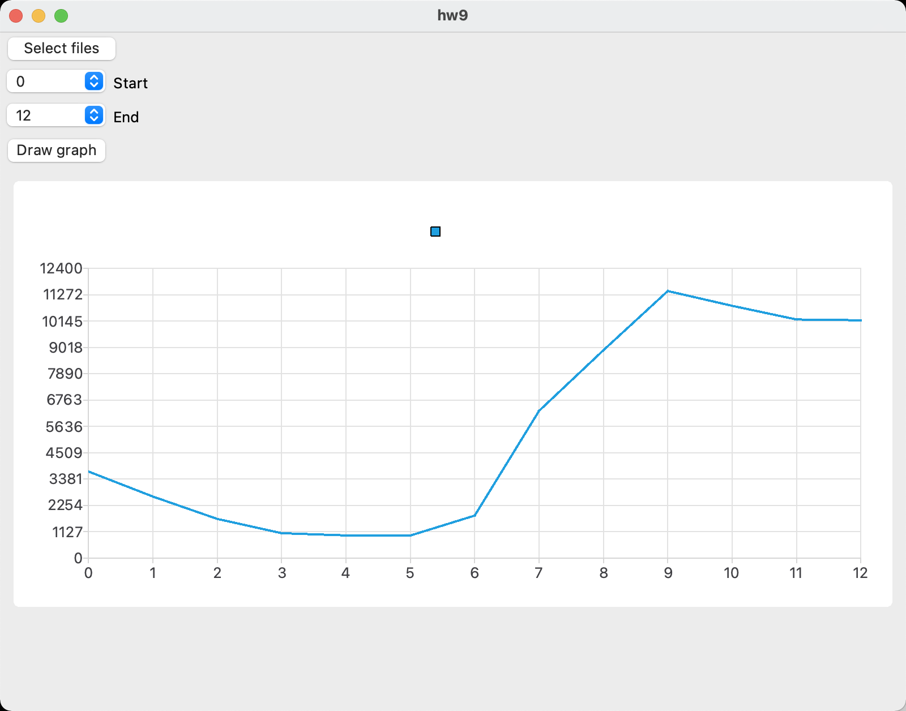
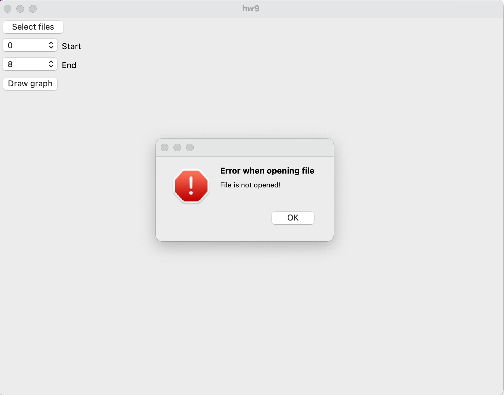
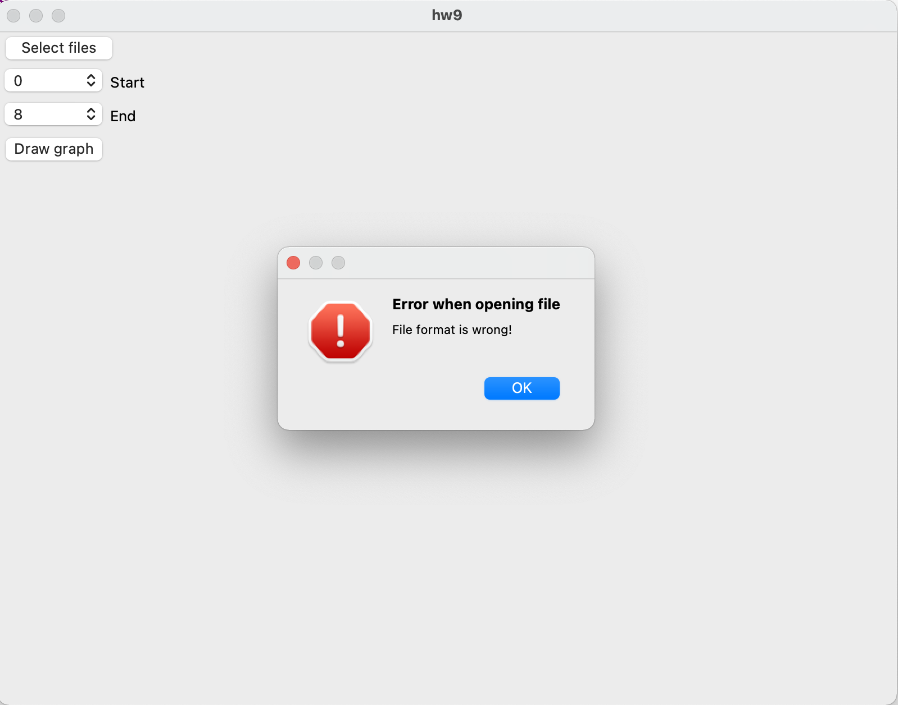
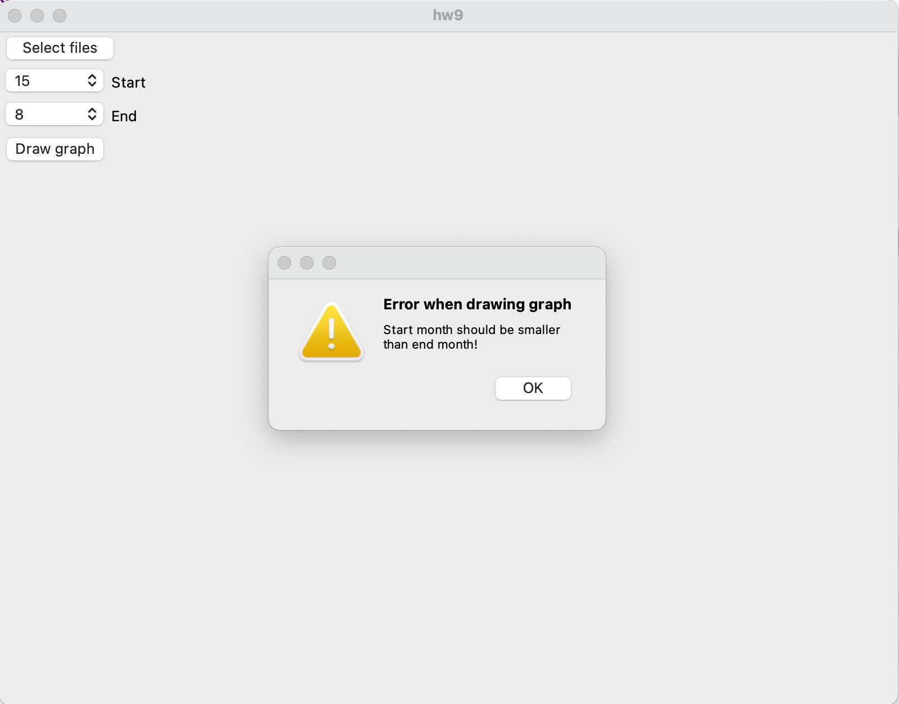

# CS241 Homework 9

After running this application, you will see a GUI like this:

Click "Select files" button and a dialog will let you select the file.

You can select the starting and ending month with the two comboboxes.

Click "Draw graph", and a graph will appear at the bottom.

If you select no file or file with wrong format, the APP will warn you.

If Start is larger than End, it will also warn you.

